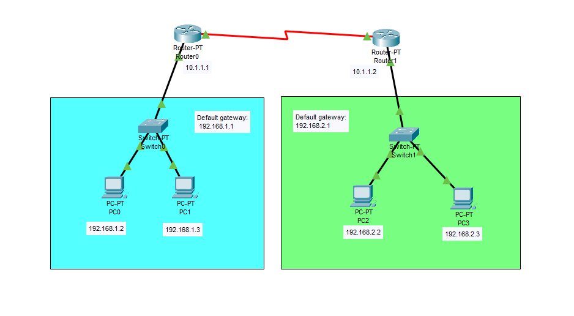

# WAN Network Tutorial - Cisco Packet Tracer

This is a guide to implement a WAN network in Cisco Packet Tracer.



## Devices

Router:
- Router Model Name: Router-PT
- Quantity: 2

Switch:
- Switch Model Name: Switch-PT
- Quantity: 2

PC:
- PC Model Name: PC-PT
- Quantity: 4

## Configure IP Addresses

### IP Address Table for PCs

PC0:
- IPv4 Address: 192.168.1.2
- Subnet Mask: 255.255.255.0
- Default Gateway: 192.168.1.1

PC1:
- IPv4 Address: 192.168.1.3
- Subnet Mask: 255.255.255.0
- Default Gateway: 192.168.1.1

PC2:
- IPv4 Address: 192.168.2.2
- Subnet Mask: 255.255.255.0
- Default Gateway: 192.168.2.1

PC3:
- IPv4 Address: 192.168.2.3
- Subnet Mask: 255.255.255.0
- Default Gateway: 192.168.2.1

### IP Address Table for Routers:

Router0:
- Serial2/0: 10.1.1.1
    - Subnet Mask: 255.255.255.0
- FastEthernet0/0: 192.168.1.1
    - Subnet Mask: 255.255.255.0

Router1:
- Serial2/0: 10.1.1.2
    - Subnet Mask: 255.255.255.0
- FastEthernet0/0: 192.168.2.1
    - Subnet Mask: 255.255.255.0

### Configure IP Addresses for the PCs

Go to Desktop -> IP Configuration. Set the **IPv4 Address**, and **Default Gateway**
for each PC. Make sure the IP addresses of the PCs matches with the information at
the *IP Address Table for PCs* section.

### Configure IP Addresses for the Routers

Configure the IP addresses for the two routers. You have to configure the
ip address for the FastEthernet0/0 and Serial2/0 ports for each router.

**FastEthernet0/0**

Router0:
```
Router>en
Router#config t
Router(config)#int FastEthernet0/0
Router(config-if)#ip add 192.168.1.1 255.255.255.0
Router(config-if)#no shut
```

Router1:
```
Router>en  
Router#config t 
Router(config)#int FastEthernet0/0
Router(config-if)#ip add 192.168.2.1 255.255.255.0  
Router(config-if)#no shut
```

**Serial2/0**

Router0:
```
Router>en
Router#config t
Router(config)#int Serial2/0
Router(config-if)#ip add 10.1.1.1 255.255.255.0
Router(config-if)#no shut
```

Router1:
```
Router>en
Router#config t
Router(config)#int Serial2/0
Router(config-if)#ip add 10.1.1.2 255.255.255.0
Router(config-if)#no shut
```

## Configure Routing

Configure static routes for the two routers in order for the PCs to communicate with each other.

Router0:
```
Router>en  
Router#config t 
Router(config)#ip route 192.168.2.0 255.255.255.0 10.1.1.2
```

Router1:
```
Router>en  
Router#config t 
Router(config)#ip route 192.168.1.0 255.255.255.0 10.1.1.1
```

## Check Connectivity Between PCs

Ping each PC to check if the four PCs can communicate with each other.

Ping PCs from PC0

PC0 -> PC1:
```
ping 192.168.1.3
```

PC0 -> PC2:
```
ping 192.168.2.2
```

PC0 -> PC3:
```
ping 192.168.2.3
```

Ping PCs from PC1

PC1 -> PC0:
```
ping 192.168.1.2
```

PC1 -> PC2:
```
ping 192.168.2.2
```

PC1 -> PC3:
```
ping 192.168.2.3
```

Ping PCs from PC2

PC2 -> PC3:
```
ping 192.168.2.3
```

PC2 -> PC0:
```
ping 192.168.1.2
```

PC2 -> PC1:
```
ping 192.168.1.3
```

Ping PCs from PC3

PC3 -> PC2:
```
ping 192.168.2.2
```

PC3 -> PC0:
```
ping 192.168.1.2
```

PC3 -> PC1:
```
ping 192.168.1.3
```

These should work.

Congratulations, you setup a WAN network!

## Resources

- [Implementation of Static Routing in Cisco - 2 Router Connections](https://www.geeksforgeeks.org/computer-networks/implementation-of-static-routing-in-cisco-2-router-connections/)
