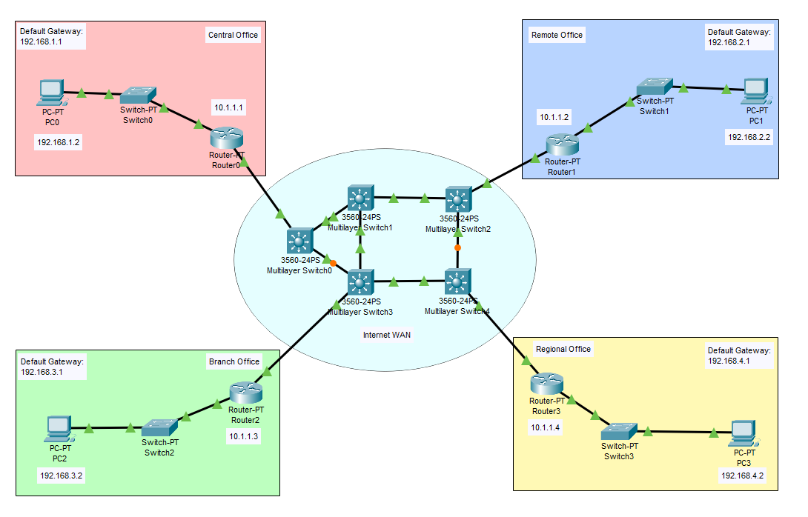

# Branch Network Tutorial

This is a guide to setup a branch network.



## Configure IP Addresses

### IP Address Table for PCs
PC0:
- IPv4 Address: 192.168.1.2
- Subnet Mask: 255.255.255.0
- Default Gateway: 192.168.1.1

PC1:
- IPv4 Address: 192.168.2.2
- Subnet Mask: 255.255.255.0
- Default Gateway: 192.168.2.1

PC2:
- IPv4 Address: 192.168.3.2
- Subnet Mask: 255.255.255.0
- Default Gateway: 192.168.3.1

PC3:
- IPv4 Address: 192.168.4.2
- Subnet Mask: 255.255.255.0
- Default Gateway: 192.168.4.1

### IP Address Table for Routers
Router0:
- FastEthernet0/0: 10.1.1.1
    - Subnet Mask: 255.255.255.0
- FastEthernet1/0: 192.168.1.1
    - Subnet Mask: 255.255.255.0

Router1:
- FastEthernet0/0: 10.1.1.2
    - Subnet Mask: 255.255.255.0
- FastEthernet1/0: 192.168.2.1
    - Subnet Mask: 255.255.255.0

Router2:
- FastEthernet0/0: 10.1.1.3
    - Subnet Mask: 255.255.255.0
- FastEthernet1/0: 192.168.3.1
    - Subnet Mask: 255.255.255.0

Router3:
- FastEthernet0/0: 10.1.1.4
    - Subnet Mask: 255.255.255.0
- FastEthernet1/0: 192.168.4.1
    - Subnet Mask: 255.255.255.0
### Configure IP Addresses for the PCs

Go to Desktop -> IP Configuration. Set the **IPv4 Address**, and **Default Gateway** for each PC. Make sure the IP addresses of the PCs matches with the information at the *IP Address Table for PCs* section.
### Configure IP Addresses for the Routers

**FastEthernet0/0**

Router0:
```
Router>en
Router#config t
Router(config)#int FastEthernet0/0
Router(config-if)#ip add 10.1.1.1 255.255.255.0
Router(config-if)#no shut
```

Router1:
```
Router>en
Router#config t
Router(config)#int FastEthernet0/0
Router(config-if)#ip add 10.1.1.2 255.255.255.0
Router(config-if)#no shut
```

Router2:
```
Router>en
Router#config t
Router(config)#int FastEthernet0/0
Router(config-if)#ip add 10.1.1.3 255.255.255.0
Router(config-if)#no shut
```

Router3:
```
Router>en
Router#config t
Router(config)#int FastEthernet0/0
Router(config-if)#ip add 10.1.1.4 255.255.255.0
Router(config-if)#no shut
```

**FastEthernet1/0**

Router0:
```
Router>en
Router#config t
Router(config)#int FastEthernet1/0
Router(config-if)#ip add 192.168.1.1 255.255.255.0
Router(config-if)#no shut
```

Router1:
```
Router>en
Router#config t
Router(config)#int FastEthernet1/0
Router(config-if)#ip add 192.168.2.1 255.255.255.0
Router(config-if)#no shut
```

Router2:
```
Router>en
Router#config t
Router(config)#int FastEthernet1/0
Router(config-if)#ip add 192.168.3.1 255.255.255.0
Router(config-if)#no shut
```

Router3:
```
Router>en
Router#config t
Router(config)#int FastEthernet1/0
Router(config-if)#ip add 192.168.4.1 255.255.255.0
Router(config-if)#no shut
```

## Configure Routing

Configure static routes for the two routers in order for the PCs to communicate with each other.

Router0:
```
Router>en  
Router#config t 
Router(config)#ip route 192.168.2.0 255.255.255.0 10.1.1.2
Router(config)#ip route 192.168.3.0 255.255.255.0 10.1.1.3
Router(config)#ip route 192.168.4.0 255.255.255.0 10.1.1.4
```

Router1:
```
Router>en  
Router#config t 
Router(config)#ip route 192.168.1.0 255.255.255.0 10.1.1.1
Router(config)#ip route 192.168.3.0 255.255.255.0 10.1.1.3
Router(config)#ip route 192.168.4.0 255.255.255.0 10.1.1.4
```

Router2:
```
Router>en  
Router#config t 
Router(config)#ip route 192.168.1.0 255.255.255.0 10.1.1.1
Router(config)#ip route 192.168.2.0 255.255.255.0 10.1.1.2
Router(config)#ip route 192.168.4.0 255.255.255.0 10.1.1.4
```

Router3:
```
Router>en  
Router#config t 
Router(config)#ip route 192.168.1.0 255.255.255.0 10.1.1.1
Router(config)#ip route 192.168.2.0 255.255.255.0 10.1.1.2
Router(config)#ip route 192.168.3.0 255.255.255.0 10.1.1.3
```
## Resources
- [WAN Technologies Overview (1.1) - Cisco Press](https://www.ciscopress.com/articles/article.asp?p=2832405&seqNum=4)