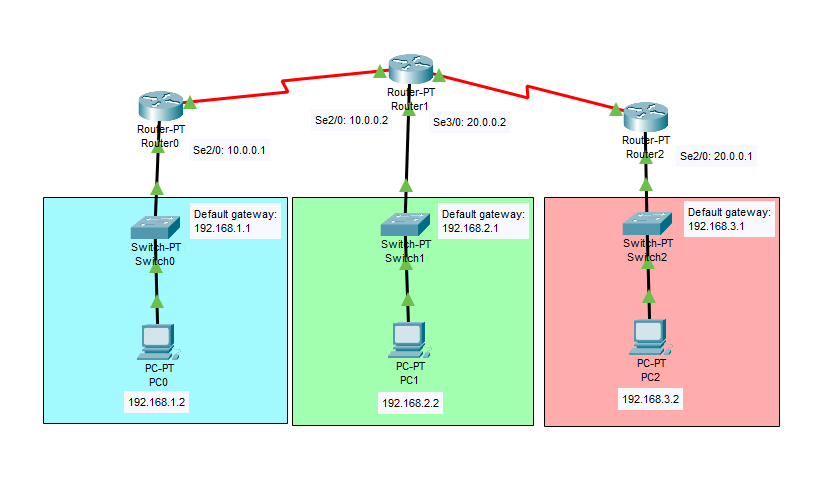

# OSPF Single Area Network Tutorial

This is a guide to setup an OSPF single area network.



## Configure IP Addresses
### IP Address Table for PCs

PC0: 
- IPv4 Address: 192.168.1.2
- Subnet Mask: 255.255.255.0
- Default Gateway: 192.168.1.1

PC1: 
- IPv4 Address: 192.168.2.2
- Subnet Mask: 255.255.255.0
- Default Gateway: 192.168.2.1

PC2: 
- IPv4 Address: 192.168.3.2
- Subnet Mask: 255.255.255.0
- Default Gateway: 192.168.3.1

### IP Address Table for Routers

Router0:
- FastEthernet0/0
	- IPv4 Address: 192.168.1.1
	- Subnet Mask: 255.255.255.0
- Serial2/0
	- IPv4 Address: 10.0.0.1
	- Subnet Mask: 255.255.255.0

Router1:
- FastEthernet0/0
	- IPv4 Address: 192.168.2.1
	- Subnet Mask: 255.255.255.0
- Serial2/0
	- IPv4 Address: 10.0.0.2
	- Subnet Mask: 255.255.255.0
- Serial3/0
	- IPv4 Address: 20.0.0.2
	- Subnet Mask: 255.255.255.0

Router2:
- FastEthernet0/0
	- IPv4 Address: 192.168.3.1
	- Subnet Mask: 255.255.255.0
- Serial2/0
	- IPv4 Address: 20.0.0.1
	- Subnet Mask: 255.255.255.0

### Configure IP Addresses for the PCs

Go to Desktop -> IP Configuration. Set the **IPv4 Address**, and **Default Gateway** for each PC.
Make sure the IP addresses of the PCs matches with the information at the *IP Address Table for PCs*
section.

### Configure IP Addresses for the Routers

**FastEthernet0/0**

Router0:
```
Router>en
Router#config t
Router(config)#int FastEthernet0/0
Router(config-if)#ip add 192.168.1.1 255.255.255.0
Router(config-if)#no shut
```

Router1:
```
Router>en
Router#config t
Router(config)#int FastEthernet0/0
Router(config-if)#ip add 192.168.2.1 255.255.255.0
Router(config-if)#no shut
```

Router2:
```
Router>en
Router#config t
Router(config)#int FastEthernet0/0
Router(config-if)#ip add 192.168.3.1 255.255.255.0
Router(config-if)#no shut
```

**Serial2/0**

Router0:
```
Router>en
Router#config t
Router(config)#int Serial2/0
Router(config-if)#ip add 10.0.0.1 255.255.255.0
Router(config-if)#no shut
```

Router1:
```
Router>en
Router#config t
Router(config)#int Serial2/0
Router(config-if)#ip add 10.0.0.2 255.255.255.0
Router(config-if)#no shut
```

Router2:
```
Router>en
Router#config t
Router(config)#int Serial2/0
Router(config-if)#ip add 20.0.0.1 255.255.255.0
Router(config-if)#no shut
```

**Serial3/0**

Router1:
```
Router>en
Router#config t
Router(config)#int Serial3/0
Router(config-if)#ip add 20.0.0.2 255.255.255.0
Router(config-if)#no shut
```

## Configure Routing via OSPF

Router0:
```
Router>en
Router#config t
Router(config)#router ospf 1
Router(config-router)#network 10.0.0.0 0.0.0.255 area 0
Router(config-router)#network 192.168.1.0 0.255.255.255 area 0
Router(config-router)#exit
```

Router1:
```
Router>en
Router#config t
Router(config)#router ospf 1
Router(config-router)#network 10.0.0.0 0.0.0.255 area 0
Router(config-router)#network 20.0.0.0 0.0.0.255 area 0
Router(config-router)#network 192.168.2.0 0.255.255.255 area 0
Router(config-router)#exit
```

Router2:
```
Router>en
Router#config t
Router(config)#router ospf 1
Router(config-router)#network 20.0.0.0 0.0.0.255 area 0
Router(config-router)#network 192.168.3.0 0.255.255.255 area 0
Router(config-router)#exit
```
## Resources:
- [OSPF Implementation - GeeksforGeeks](https://www.geeksforgeeks.org/computer-networks/ospf-implementation/)